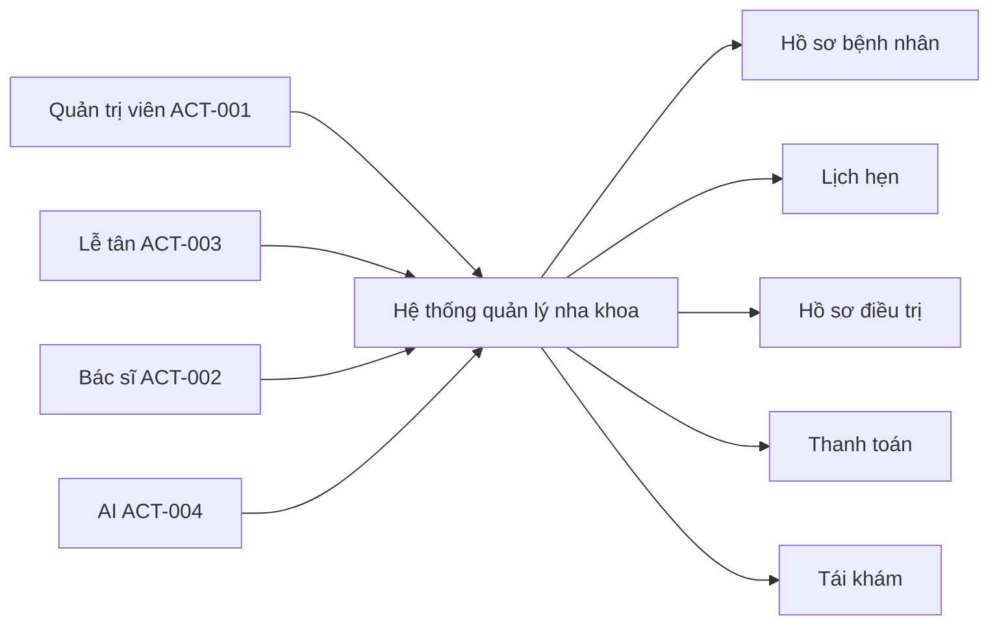

# 1. TỔNG QUAN HỆ THỐNG VÀ CÁC ACTOR

## 1.1. Mục tiêu hệ thống
Hệ thống quản lý nha khoa có tích hợp AI nhằm hỗ trợ phòng khám quản lý bệnh nhân, bác sĩ, lịch hẹn, hồ sơ điều trị, danh mục dịch vụ, thanh toán và lịch tái khám. Hệ thống phải hỗ trợ nhân viên lễ tân, bác sĩ, quản trị viên và người dùng trong quy trình quản lý nội bộ phòng khám, đồng thời tích hợp AI để hỗ trợ tóm tắt điều trị, nhắc tái khám và giải thích dịch vụ theo hướng cảnh báo an toàn y tế.

## 1.2. Bối cảnh nghiệp vụ
Theo tài liệu đầu vào, hiện trạng quản lý bằng sổ sách và bảng tính rời rạc dẫn đến sai sót xếp lịch, khó tra cứu hồ sơ bệnh nhân, hạn chế trong thống kê doanh thu và quản lý công nợ. Hệ thống cần tạo ra nền tảng quản lý tập trung, dễ tra cứu, dễ kiểm soát và đảm bảo phân quyền rõ ràng theo vai trò.

## 1.3. Actor chính
- ACT-001: Quản trị viên — quản lý hệ thống, phân quyền, theo dõi báo cáo doanh thu và hoạt động phòng khám.
- ACT-002: Bác sĩ — quản lý hồ sơ bệnh nhân, điều trị, ghi chú lâm sàng, y lệnh và tái khám.
- ACT-003: Lễ tân — quản lý đặt lịch, lịch hẹn, thông tin bệnh nhân và hỗ trợ tiếp đón.
- ACT-004: Hệ thống AI — hỗ trợ tóm tắt quá trình điều trị, sinh tin nhắn nhắc tái khám và giải thích dịch vụ.

## 1.4. Phạm vi tương tác
- Quản trị viên quản lý người dùng, phân quyền, báo cáo và giám sát vận hành.
- Lễ tân quản lý lịch hẹn và hồ sơ bệnh nhân cơ bản.
- Bác sĩ quản lý triệt để hồ sơ điều trị và y lệnh.
- Hệ thống AI nhận đầu vào từ ghi chú lâm sàng, thông tin lịch hẹn và yêu cầu giải thích dịch vụ, trả về văn bản tóm tắt hoặc nhắc nhở theo định dạng kiểm soát.

## 1.5. Giới hạn hệ thống
- Hệ thống không thay thế quyền chẩn đoán và quyết định của bác sĩ.
- Hệ thống AI chỉ là trợ lý hỗ trợ, không được dùng để xác định kết luận y khoa.
- Đối với các yêu cầu chưa có phản hồi chính thức trong Q&A, hệ thống ghi nhận ở mục Giả định nghiệp vụ.

# 2. DANH SÁCH YÊU CẦU CHỨC NĂNG (FUNCTIONAL REQUIREMENTS)

## 2.1. Danh sách yêu cầu chức năng
| Mã yêu cầu | Mô tả yêu cầu | Input | Output |
|---|---|---|---|
| REQ-F-001 | Hệ thống phải cho phép đăng nhập, đăng xuất và phân quyền theo vai trò: Quản trị viên, Bác sĩ, Lễ tân. | Tên đăng nhập, mật khẩu, vai trò | Trạng thái xác thực, quyền truy cập tương ứng |
| REQ-F-002 | Hệ thống phải quản lý hồ sơ bệnh nhân bao gồm thông tin cá nhân, tiền sử bệnh lý nha khoa và lịch sử khám chữa bệnh. | Thông tin bệnh nhân, tiền sử bệnh lý, lịch sử khám | Hồ sơ bệnh nhân được lưu và truy vấn |
| REQ-F-003 | Hệ thống phải quản lý lịch hẹn và tránh trùng khung giờ của bác sĩ. | Thời gian hẹn, bác sĩ, bệnh nhân | Lịch hẹn được tạo, cập nhật hoặc từ chối nếu có xung đột |
| REQ-F-004 | Hệ thống phải quản lý hồ sơ điều trị răng gồm chẩn đoán, y lệnh, thủ thuật và tiến độ điều trị. | Ghi chú lâm sàng, y lệnh, thủ thuật | Hồ sơ điều trị được lưu và cập nhật |
| REQ-F-005 | Hệ thống phải quản lý dịch vụ nha khoa, đơn giá, mô tả và thanh toán. | Dịch vụ, đơn giá, phương thức thanh toán | Hóa đơn, tổng tiền, trạng thái thanh toán |
| REQ-F-006 | Hệ thống phải quản lý lịch tái khám và nhắc nhở bệnh nhân theo thời điểm phù hợp. | Ngày tái khám, bệnh nhân, bác sĩ | Bản ghi tái khám và thông điệp nhắc nhở |
| REQ-F-007 | Hệ thống phải tích hợp AI để tóm tắt điều trị, sinh nhắc tái khám và giải thích dịch vụ với cảnh báo y tế. | Ghi chú lâm sàng, thông tin lịch hẹn, câu hỏi giải thích dịch vụ | Văn bản tóm tắt, tin nhắn nhắc tái khám, giải thích dịch vụ |

## 2.2. Yêu cầu chức năng chi tiết theo luồng
- REQ-F-001: Xác thực người dùng theo vai trò, ngăn truy cập trái phép.
- REQ-F-002: Cho phép tạo, xem, cập nhật và (nếu được phân quyền) xóa hồ sơ bệnh nhân.
- REQ-F-003: Cho phép đặt lịch và kiểm tra xung đột thời gian của bác sĩ.
- REQ-F-004: Cho phép bác sĩ cập nhật hồ sơ điều trị, y lệnh và tiến độ điều trị.
- REQ-F-005: Cho phép doanh thu và trạng thái thanh toán được lưu dưới dạng rõ ràng theo hóa đơn.
- REQ-F-006: Cho phép hệ thống tạo tiền cảnh báo tái khám trước ngày hẹn phù hợp.
- REQ-F-007: Tích hợp AI vào các chức năng nghiệp vụ, không thay thế khuyến nghị y khoa của bác sĩ.

# 3. DANH SÁCH YÊU CẦU PHI CHỨC NĂNG (NON-FUNCTIONAL REQUIREMENTS)

| Mã yêu cầu | Loại | Nội dung yêu cầu | Mức cần đạt |
|---|---|---|---|
| REQ-NF-001 | Bảo mật | Dữ liệu y tế phải được bảo vệ, API key không được lưu công khai. | API key đặt trong file .env; không lưu nhạy cảm trong repository |
| REQ-NF-002 | Hiệu năng | Hệ thống phải phản hồi các thao tác quản lý trong thời gian hợp lý trên dữ liệu demo. | Thời gian phản hồi chủ yếu dưới 3 giây trong môi trường local |
| REQ-NF-003 | Khả dụng | Hệ thống demo phải hoạt động ổn định trong môi trường local và hỗ trợ khởi động không quá phức tạp. | Demo chạy được trên môi trường local với dữ liệu mẫu |
| REQ-NF-004 | Khả mở rộng | Hệ thống phải sẵn sàng mở rộng bảng dữ liệu và chức năng cho các dữ liệu mới. | Cấu trúc dữ liệu dễ bổ sung thực thể mới |
| REQ-NF-005 | Giao diện | Giao diện phải rõ ràng, dễ thao tác cho nhân sự phòng khám. | Hệ thống có các màn hình chính rõ ràng cho bệnh nhân, lịch hẹn và điều trị |
| REQ-NF-006 | Độ tin cậy AI | AI phải kiểm soát lỗi đầu vào/đầu ra, không sinh nội dung vượt quá phạm vi y tế. | Có cảnh báo y tế, kiểm tra kết quả trả về và xử lý timeout |

# 4. CÁC QUY TẮC NGHIỆP VỤ (BUSINESS RULES)

| Mã quy tắc | Nội dung quy tắc |
|---|---|
| BR-001 | Chỉ Quản trị viên, Bác sĩ và Lễ tân mới được truy cập hệ thống theo quyền được phân công. |
| BR-002 | Không cho phép tạo lịch hẹn nếu bác sĩ đã có lịch hẹn cùng khung giờ. |
| BR-003 | Mỗi bệnh nhân phải có hồ sơ cá nhân và tiền sử bệnh lý rõ ràng trước khi đặt lịch. |
| BR-004 | Bác sĩ phải cập nhật chẩn đoán, y lệnh và thủ thuật trước khi ghi nhận hoàn tất điều trị. |
| BR-005 | Mỗi hóa đơn phải có tổng tiền, phương thức thanh toán và trạng thái thanh toán rõ ràng. |
| BR-006 | Tin nhắn nhắc tái khám chỉ được tạo dựa trên dữ liệu tái khám hợp lệ và phải có cảnh báo y tế nếu cần. |
| BR-007 | Giải thích dịch vụ của AI chỉ mang tính tham khảo và phải đi kèm cảnh báo rằng không thay thế chẩn đoán của bác sĩ. |
| BR-008 | Tất cả dữ liệu nhạy cảm của bệnh nhân phải được xử lý theo nguyên tắc tối thiểu hóa thông tin khi gọi AI. |

# 5. ĐẶC TẢ USE CASE CHI TIẾT

## 5.1. Use Case: Đăng nhập hệ thống
- Mã UC: UC-001
- Actor chính: ACT-001, ACT-002, ACT-003
- Yêu cầu liên kết: REQ-F-001
- Tiền điều kiện: Người dùng đã có tài khoản trong hệ thống.
- Hậu điều kiện: Người dùng vào được hệ thống theo quyền tương ứng.
- Luồng chính:
  1. Người dùng nhập username và password.
  2. Hệ thống xác thực thông tin.
  3. Hệ thống xác định vai trò và giao diện tương ứng.
  4. Hệ thống đăng nhập thành công và hiển thị màn hình chính.
- Luồng ngoại lệ:
  1. Nếu thông tin sai, hệ thống hiển thị thông báo lỗi và không cho phép truy cập.
  2. Nếu tài khoản bị khóa, hệ thống báo lỗi và yêu cầu liên hệ quản trị viên.

## 5.2. Use Case: Quản lý bệnh nhân
- Mã UC: UC-002
- Actor chính: ACT-003, ACT-002, ACT-001
- Yêu cầu liên kết: REQ-F-002
- Tiền điều kiện: Người dùng đã đăng nhập hệ thống.
- Hậu điều kiện: Hồ sơ bệnh nhân được lưu và truy vấn được.
- Luồng chính:
  1. Lễ tân hoặc bác sĩ nhập thông tin bệnh nhân.
  2. Hệ thống kiểm tra dữ liệu bắt buộc.
  3. Hệ thống lưu hồ sơ và hiển thị xác nhận thành công.
- Luồng ngoại lệ:
  1. Nếu dữ liệu không hợp lệ, hệ thống báo lỗi và không lưu thông tin.
  2. Nếu bệnh nhân đã tồn tại, hệ thống yêu cầu kiểm tra trùng lặp trước khi lưu.

## 5.3. Use Case: Đặt lịch hẹn và kiểm tra xung đột
- Mã UC: UC-003
- Actor chính: ACT-003, ACT-001
- Yêu cầu liên kết: REQ-F-003
- Tiền điều kiện: Bệnh nhân đã có hồ sơ và người dùng đã đăng nhập.
- Hậu điều kiện: Lịch hẹn được tạo hoặc từ chối nếu có xung đột.
- Luồng chính:
  1. Lễ tân nhập thông tin lịch hẹn.
  2. Hệ thống kiểm tra bác sĩ có trùng khung giờ không.
  3. Nếu hợp lệ, hệ thống lưu lịch hẹn.
  4. Hệ thống hiển thị xác nhận đặt lịch.
- Luồng ngoại lệ:
  1. Nếu khung giờ bị trùng, hệ thống hiển thị cảnh báo và không lưu lịch hẹn.
  2. Nếu dữ liệu thiếu, hệ thống yêu cầu nhập lại thông tin bắt buộc.

## 5.4. Use Case: Quản lý hồ sơ điều trị răng
- Mã UC: UC-004
- Actor chính: ACT-002
- Yêu cầu liên kết: REQ-F-004
- Tiền điều kiện: Bệnh nhân đã có hồ sơ và lịch hẹn tương ứng.
- Hậu điều kiện: Hồ sơ điều trị được cập nhật đầy đủ.
- Luồng chính:
  1. Bác sĩ mở hồ sơ bệnh nhân.
  2. Bác sĩ nhập chẩn đoán, y lệnh và thủ thuật.
  3. Hệ thống lưu thông tin điều trị.
  4. Hệ thống hiển thị tiến độ điều trị.
- Luồng ngoại lệ:
  1. Nếu dữ liệu thiếu, hệ thống báo lỗi.
  2. Nếu thông tin điều trị chưa được hoàn tất, hệ thống cảnh báo chưa thể đóng cuộc hẹn.

## 5.5. Use Case: Tạo AI hỗ trợ điều trị / nhắc tái khám / giải thích dịch vụ
- Mã UC: UC-005
- Actor chính: ACT-002, ACT-004
- Yêu cầu liên kết: REQ-F-006, REQ-F-007
- Tiền điều kiện: Có dữ liệu khám bệnh và nội dung cần xử lý bằng AI.
- Hậu điều kiện: Hệ thống tạo ra bản tóm tắt, tin nhắn nhắc tái khám hoặc giải thích dịch vụ kèm cảnh báo.
- Luồng chính:
  1. Người dùng chọn chức năng AI.
  2. Hệ thống thu thập dữ liệu cần thiết như ghi chú lâm sàng hoặc thông tin tái khám.
  3. Hệ thống gửi dữ liệu tới mô hình AI theo định dạng kiểm soát.
  4. Hệ thống nhận kết quả và hiển thị cho người dùng.
- Luồng ngoại lệ:
  1. Nếu AI timeout hoặc đầu ra sai định dạng, hệ thống hiển thị cảnh báo và yêu cầu thử lại.
  2. Nếu dữ liệu đầu vào không đủ, hệ thống thống báo thiếu thông tin.

## 5.6. Use Case: Quản lý thanh toán và hóa đơn
- Mã UC: UC-006
- Actor chính: ACT-001, ACT-003
- Yêu cầu liên kết: REQ-F-005
- Tiền điều kiện: Dịch vụ và lịch hẹn đã được xác nhận.
- Hậu điều kiện: Hóa đơn được ghi nhận và trạng thái thanh toán rõ ràng.
- Luồng chính:
  1. Lễ tân hoặc quản trị viên mở hồ sơ dịch vụ và hóa đơn.
  2. Hệ thống tính tổng tiền và áp dụng quy định thanh toán.
  3. Hệ thống lưu hóa đơn và trạng thái thanh toán.
- Luồng ngoại lệ:
  1. Nếu thông tin thanh toán thiếu, hệ thống báo lỗi.
  2. Nếu thanh toán chưa hoàn tất, hóa đơn được giữ ở trạng thái chờ thanh toán.

# 6. MA TRẬN TRUY VẾT YÊU CẦU (RTM - STAGE 1)

| Mã yêu cầu | Mô tả yêu cầu | Mã Use Case liên quan | Mã Business Rule liên quan |
|---|---|---|---|
| REQ-F-001 | Đăng nhập, đăng xuất, phân quyền | UC-001 | BR-001 |
| REQ-F-002 | Quản lý hồ sơ bệnh nhân | UC-002 | BR-003 |
| REQ-F-003 | Quản lý lịch hẹn, tránh trùng khung giờ | UC-003 | BR-002 |
| REQ-F-004 | Quản lý hồ sơ điều trị răng | UC-004 | BR-004 |
| REQ-F-005 | Quản lý dịch vụ, thanh toán, hóa đơn | UC-006 | BR-005 |
| REQ-F-006 | Quản lý lịch tái khám và nhắc nhở | UC-005 | BR-006 |
| REQ-F-007 | AI tóm tắt điều trị, giải thích dịch vụ | UC-005 | BR-006, BR-007, BR-008 |
| REQ-NF-001 | Bảo mật dữ liệu và API key | UC-001, UC-005 | BR-008 |
| REQ-NF-002 | Hiệu năng phản hồi | UC-003, UC-005 | BR-002, BR-006 |
| REQ-NF-003 | Khả dụng demo local | UC-001, UC-002, UC-003 | BR-001 |
| REQ-NF-004 | Khả mở rộng dữ liệu | UC-002, UC-004, UC-006 | BR-003, BR-005 |
| REQ-NF-005 | Giao diện cơ bản | UC-001, UC-002, UC-003 | BR-001 |
| REQ-NF-006 | Độ tin cậy AI | UC-005 | BR-006, BR-007, BR-008 |

# 7. GIẢ ĐỊNH NGHIỆP VỤ VÀ VẤN ĐỀ CHỜ XÁC MINH

## 7.1. Giả định nghiệp vụ
- Giả định 1: Hệ thống demo chạy trên môi trường local với số lượng dữ liệu vừa phải, không yêu cầu quy mô doanh nghiệp lớn.
- Giả định 2: Mỗi vai trò có quyền truy cập khác nhau, nhưng quyền chi tiết từng chức năng cần được xác nhận thêm trong giai đoạn thiết kế tiếp theo.
- Giả định 3: Hệ thống AI hoạt động như một trợ lý hỗ trợ và không được dùng để thay thế chẩn đoán của bác sĩ.
- Giả định 4: Mỗi lịch hẹn, hóa đơn và hồ sơ tái khám đều được lưu lại đầy đủ để phục vụ báo cáo và truy vết.
- Giả định 5: Cảnh báo y tế trong AI là bắt buộc với mỗi nội dung giải thích dịch vụ và nhắc tái khám có liên quan tới y khoa.

## 7.2. Vấn đề chờ xác minh
- Quy trình nghiệp vụ từ khi đặt lịch đến khi thanh toán hoàn tất chưa được mô tả chi tiết đầy đủ.
- Quyền truy cập chi tiết theo từng chức năng của Quản trị viên, Bác sĩ và Lễ tân vẫn cần xác nhận rõ hơn.
- Cấu trúc dữ liệu của lịch hẹn/tái khám có cần phân loại trạng thái nào chưa được xác định chính thức.
- Mức giới hạn AI (timeout, phân loại lỗi, định dạng đầu ra) cần được xác nhận trong bước thiết kế kỹ thuật tiếp theo.
- Chưa xác định cụ thể công nghệ AI provider nào sẽ được lựa chọn, nên định dạng đầu vào/đầu ra cần giữ ở mức chuẩn hóa chung.

## 7.3. Kết luận
Tài liệu đặc tả yêu cầu phần mềm ở bước này đã xác định được bối cảnh hệ thống, các actor, danh sách yêu cầu chức năng và phi chức năng, các quy tắc nghiệp vụ, cùng các use case cốt lõi của hệ thống quản lý nha khoa có tích hợp AI. Các thành phần này phù hợp để làm cơ sở cho thiết kế tiếp theo và đảm bảo tính nhất quán giữa nghiệp vụ, ràng buộc và tích hợp AI. Tuy nhiên, các vấn đề chờ xác minh vẫn cần được làm rõ để tránh sai lệch trong các bước tiếp theo của SDLC.
