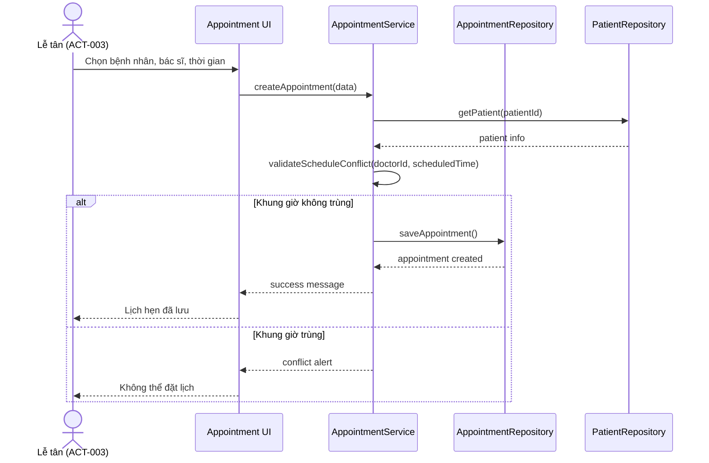
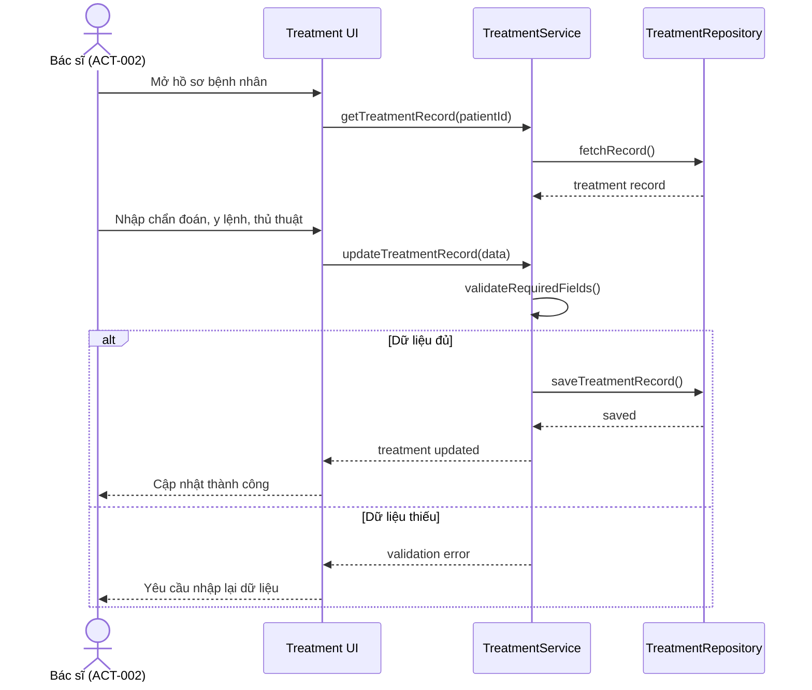
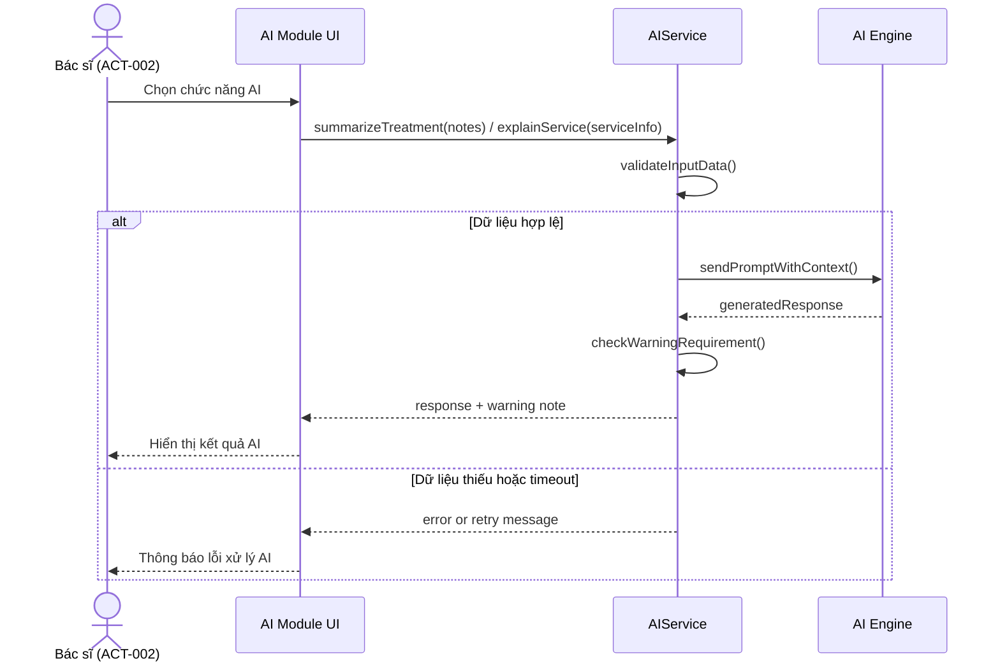

# 1. KIẾN TRÚC TỔNG QUAN VÀ PHÂN CHIA MODULE

## 1.1. Mô hình kiến trúc đề xuất
Hệ thống được thiết kế theo mô hình Layered Architecture / 3-Tier với sự phân tách rõ ràng giữa Presentation Layer, Application Layer và Data Access / Domain Layer. Mô hình này phù hợp với dự án quản lý phòng khám nha khoa có tính năng AI hỗ trợ, giúp dễ kiểm soát quyền truy cập, chia rõ trách nhiệm và mở rộng thêm chức năng trong tương lai.

### Các module chính
- MOD-001: User Management Module — xác thực, phân quyền, quản lý tài khoản người dùng.
- MOD-002: Patient Management Module — quản lý hồ sơ bệnh nhân.
- MOD-003: Appointment Management Module — đặt lịch hẹn, xác nhận lịch, kiểm tra xung đột.
- MOD-004: Treatment Management Module — hồ sơ điều trị, chẩn đoán, y lệnh, thủ thuật.
- MOD-005: Service & Billing Module — dịch vụ, hóa đơn, thanh toán, trạng thái thanh toán.
- MOD-006: AI Support Module — tóm tắt điều trị, nhắc tái khám, giải thích dịch vụ.

## 1.2. Phân chia trách nhiệm
- Presentation Layer: giao diện màn hình, form nhập, màn hình danh sách và báo cáo.
- Application Layer: controller/service xử lý nghiệp vụ, kiểm tra quyền, validate logic.
- Domain Layer: các entity, value object, business rules, service logic tương ứng với nghiệp vụ y khoa.
- Infrastructure Layer: repository, AI client, logging, security configuration.

# 2. THIẾT KẾ LỚP TĨNH (CLASS & INTERFACE DIAGRAMS)

## 2.1. Danh sách Class và Interface

### Interface
- IF-001: IUserService — xác thực và phân quyền người dùng.
- IF-002: IPatientRepository — thao tác lưu trữ và truy vấn bệnh nhân.
- IF-003: IAppointmentRepository — thao tác lưu trữ và truy vấn lịch hẹn.
- IF-004: ITreatmentRepository — thao tác lưu trữ và truy vấn hồ sơ điều trị.
- IF-005: IInvoiceService — tính toán và quản lý hóa đơn.
- IF-006: IAIService — giao tiếp với mô hình AI hỗ trợ.

### Class
- CLS-001: User — tài khoản người dùng.
- CLS-002: Role — vai trò phân quyền.
- CLS-003: Patient — hồ sơ bệnh nhân.
- CLS-004: Appointment — lịch hẹn khám.
- CLS-005: TreatmentRecord — hồ sơ điều trị.
- CLS-006: ServiceCatalog — danh mục dịch vụ.
- CLS-007: Invoice — hóa đơn thanh toán.
- CLS-008: RevisitReminder — nhắc tái khám.
- CLS-009: AIResponse — kết quả do AI sinh ra.
- CLS-010: UserService — service xác thực và phân quyền.
- CLS-011: PatientService — service quản lý bệnh nhân.
- CLS-012: AppointmentService — service đặt lịch và kiểm tra xung đột.
- CLS-013: TreatmentService — service quản lý hồ sơ điều trị.
- CLS-014: BillingService — service tính tiền và ghi nhận thanh toán.
- CLS-015: AIService — service gọi mô hình AI và kiểm soát cảnh báo y tế.
- CLS-016: AppointmentRepository — repository lịch hẹn.
- CLS-017: PatientRepository — repository bệnh nhân.
- CLS-018: TreatmentRepository — repository điều trị.

## 2.2. Class Diagram (Mermaid)

```mermaid
classDiagram
    class User {
        +userId: string
        +username: string
        +passwordHash: string
        +role: Role
        +login(username, password): boolean
        +logout(): void
    }

    class Role {
        +roleId: string
        +roleName: string
        +permissions: List<string>
        +hasPermission(permission: string): boolean
    }

    class Patient {
        +patientId: string
        +fullName: string
        +phoneNumber: string
        +medicalHistory: string
        +registerPatient(): void
        +updateProfile(): void
    }

    class Appointment {
        +appointmentId: string
        +patientId: string
        +doctorId: string
        +scheduledTime: DateTime
        +status: string
        +createAppointment(): void
        +cancelAppointment(): void
        +checkConflict(): boolean
    }

    class TreatmentRecord {
        +recordId: string
        +patientId: string
        +doctorId: string
        +diagnosis: string
        +prescription: string
        +procedure: string
        +recordTreatment(): void
        +completeTreatment(): void
    }

    class ServiceCatalog {
        +serviceId: string
        +serviceName: string
        +description: string
        +unitPrice: decimal
        +getServiceInfo(): string
    }

    class Invoice {
        +invoiceId: string
        +patientId: string
        +totalAmount: decimal
        +paymentMethod: string
        +paymentStatus: string
        +calculateTotal(): decimal
        +recordPayment(): void
    }

    class RevisitReminder {
        +reminderId: string
        +patientId: string
        +revisitDate: DateTime
        +messageContent: string
        +generateReminder(): void
    }

    class AIResponse {
        +responseId: string
        +text: string
        +warning: string
        +responseType: string
    }

    class UserService {
        +authenticateUser(username, password): User
        +authorize(user, permission): boolean
    }

    class PatientService {
        +createPatient(patient): Patient
        +getPatient(patientId): Patient
        +updatePatient(patient): Patient
    }

    class AppointmentService {
        +createAppointment(appointment): Appointment
        +validateScheduleConflict(doctorId, scheduledTime): boolean
    }

    class TreatmentService {
        +createTreatmentRecord(record): TreatmentRecord
        +updateTreatmentRecord(record): TreatmentRecord
    }

    class BillingService {
        +calculateInvoice(serviceList, discount): decimal
        +createInvoice(invoice): Invoice
    }

    class AIService {
        +summarizeTreatment(notes): AIResponse
        +generateReminderMessage(revisitDate): AIResponse
        +explainService(serviceInfo): AIResponse
    }

    class PatientRepository
    class AppointmentRepository
    class TreatmentRepository

    User --> Role
    UserService ..|> IF-001
    PatientService --> Patient
    AppointmentService --> Appointment
    TreatmentService --> TreatmentRecord
    BillingService --> Invoice
    AIService --> AIResponse
    Patient --> Appointment
    Patient --> TreatmentRecord
    Patient --> Invoice
    Patient --> RevisitReminder
    PatientRepository ..|> IF-002
    AppointmentRepository ..|> IF-003
    TreatmentRepository ..|> IF-004
    PatientService --> PatientRepository
    AppointmentService --> AppointmentRepository
    TreatmentService --> TreatmentRepository
    BillingService --> ServiceCatalog
```

## 2.3. Mối quan hệ chính
- User và Role có quan hệ composition / association với quyền truy cập.
- Patient có association với Appointment, TreatmentRecord, Invoice, RevisitReminder.
- AppointmentService kiểm tra xung đột thời gian trước khi tạo lịch hẹn.
- TreatmentService quản lý logic điều trị và cập nhật hồ sơ y tế.
- BillingService tích hợp ServiceCatalog để tính phí và ghi nhận hóa đơn.
- AIService là module độc lập nhưng gắn với các nghiệp vụ điều trị, tái khám và giải thích dịch vụ.

# 3. THIẾT KẾ LUỒNG ĐỘNG (SEQUENCE DIAGRAMS)

## 3.1. Sequence Diagram: Đặt lịch hẹn

## 3.2. Sequence Diagram: Cập nhật hồ sơ điều trị

## 3.3. Sequence Diagram: AI hỗ trợ giải thích dịch vụ và tóm tắt điều trị

# 4. NGUYÊN TẮC THIẾT KẾ VÀ DESIGN PATTERNS ÁP DỤNG

## 4.1. Nguyên tắc thiết kế áp dụng
- Single Responsibility Principle: mỗi class chỉ chịu trách nhiệm cho một phần logic nghiệp vụ.
- Open/Closed Principle: thêm chức năng mới không cần phá vỡ class hiện có.
- Liskov Substitution Principle: các lớp kế thừa phải đảm bảo thay thế chức năng tương ứng.
- Interface Segregation Principle: giao diện tách rõ theo nghiệp vụ để dễ mở rộng.
- Dependency Inversion Principle: service phụ thuộc vào interface thay vì phụ thuộc trực tiếp vào repository hoặc AI engine.

## 4.2. Design patterns phù hợp
- Repository Pattern: quản lý truy xuất dữ liệu cho Patient, Appointment, Treatment.
- Service Layer Pattern: tách nghiệp vụ và logic xác thực khỏi UI.
- Facade Pattern: AIService đóng vai trò trung gian giữa UI và mô hình AI.
- Strategy Pattern: có thể chọn cơ chế AI provider hoặc định dạng phản hồi khác nhau trong tương lai.

# 5. MA TRẬN TRUY VẾT THIẾT KẾ (TRACEABILITY MATRIX - STAGE 2)

| Use Case / REQ | Module | Class/Interface liên quan | Ghi chú |
|---|---|---|---|
| UC-001 / REQ-F-001 | MOD-001 | CLS-001, CLS-002, CLS-010, IF-001 | Xác thực và phân quyền |
| UC-002 / REQ-F-002 | MOD-002 | CLS-003, CLS-017, CLS-011, IF-002 | Quản lý bệnh nhân |
| UC-003 / REQ-F-003 | MOD-003 | CLS-004, CLS-012, CLS-016, IF-003 | Đặt lịch, kiểm tra trùng |
| UC-004 / REQ-F-004 | MOD-004 | CLS-005, CLS-013, CLS-018, IF-004 | Quản lý điều trị |
| UC-005 / REQ-F-006 / REQ-F-007 | MOD-006 | CLS-008, CLS-009, CLS-015, IF-006 | AI nhắc tái khám và giải thích dịch vụ |
| UC-006 / REQ-F-005 | MOD-005 | CLS-006, CLS-007, CLS-014, IF-005 | Dịch vụ, hóa đơn, thanh toán |
| BR-001, BR-002, BR-008 | MOD-001, MOD-003, MOD-006 | CLS-002, CLS-010, CLS-012, CLS-015 | Quyền truy cập và bảo mật |
| BR-004, BR-006, BR-007 | MOD-004, MOD-006 | CLS-005, CLS-008, CLS-015 | Điều trị, tái khám, cảnh báo |

## 5.1. Kết luận thiết kế
Thiết kế hướng đối tượng ở cấp độ tổng quát đã xác định rõ các module chính, các lớp cần có, các interface nghiệp vụ và luồng xử lý quan trọng cho hệ thống quản lý nha khoa có tích hợp AI. Thiết kế này hỗ trợ cho giai đoạn phát triển tiếp theo trong các lớp service, repository và AI integration mà vẫn đảm bảo sự tách biệt giữa nghiệp vụ, bảo mật và dữ liệu.
