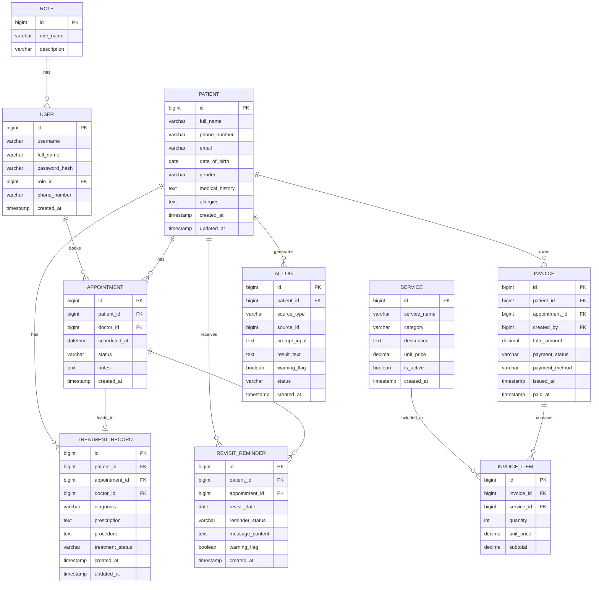

# 1. TỔNG QUAN VỀ THIẾT KẾ CƠ SỞ DỮ LIỆU

## 1.1. Mục tiêu thiết kế
Thiết kế cơ sở dữ liệu cho hệ thống quản lý nha khoa có tích hợp AI nhằm lưu trữ đầy đủ dữ liệu nghiệp vụ từ hồ sơ bệnh nhân, lịch hẹn, hồ sơ điều trị, dịch vụ, thanh toán, nhắc tái khám và các phản hồi AI. Mục tiêu là đảm bảo dữ liệu rõ ràng, nhất quán, dễ truy xuất, hỗ trợ báo cáo và tuân thủ các quy tắc nghiệp vụ đã định nghĩa ở các bước trước.

## 1.2. Thực thể dữ liệu chính
- DB-ENT-001: Vai trò người dùng (role)
- DB-ENT-002: Người dùng hệ thống (user)
- DB-ENT-003: Bệnh nhân (patient)
- DB-ENT-004: Lịch hẹn (appointment)
- DB-ENT-005: Hồ sơ điều trị (treatment_record)
- DB-ENT-006: Dịch vụ nha khoa (service)
- DB-ENT-007: Hóa đơn và thanh toán (invoice)
- DB-ENT-008: Chi tiết hóa đơn (invoice_item)
- DB-ENT-009: Nhắc tái khám (revisit_reminder)
- DB-ENT-010: Nhật ký AI (ai_log)

## 1.3. Mô hình dữ liệu logic
- Mỗi vai trò có nhiều người dùng: 1-N
- Mỗi người dùng có thể tạo nhiều lịch hẹn: 1-N
- Mỗi bệnh nhân có nhiều lịch hẹn: 1-N
- Mỗi bệnh nhân có nhiều hồ sơ điều trị: 1-N
- Mỗi bệnh nhân có nhiều hóa đơn: 1-N
- Mỗi hóa đơn có nhiều chi tiết dịch vụ: 1-N
- Mỗi dịch vụ có thể xuất hiện ở nhiều hóa đơn: N-N qua invoice_item
- Mỗi bệnh nhân có nhiều nhắc tái khám: 1-N
- Mỗi AI log liên kết với một thực thể nguồn như bệnh nhân, lịch hẹn hoặc hồ sơ điều trị: 1-N (theo dạng phân loại nguồn)

## 1.4. Quy ước mã định danh dữ liệu
- Entity/Table: `DB-ENT-xxx` và `DB-TBL-xxx`
- Field/Column: `DB-FLD-xxx`
- Tên bảng, tên cột: viết bằng snake_case, tiếng Anh, rõ nghĩa
- Khóa chính (PK): định nghĩa rõ trên mỗi bảng
- Khóa ngoại (FK): liên kết với bảng liên quan theo nguyên tắc AI/AI hỗ trợ không phụ thuộc trực tiếp vào bảng khác ngoài trường nguồn

# 2. SƠ ĐỒ QUAN HỆ THỰC THỂ (ERD DIAGRAM)



# 3. ĐẶC TẢ CHI TIẾT CÁC BẢNG DỮ LIỆU (PHYSICAL SCHEMA)

## 3.1. Bảng `roles` (DB-TBL-001)
| Tên cột | Mã trường | Kiểu dữ liệu | PK | FK | Nullable | Mặc định | Mô tả | Nguồn gốc |
|---|---|---|---|---|---|---|---|---|
| id | DB-FLD-001 | BIGINT | x | | NO | Auto | Khóa chính | CLS-001 / ACT-001 |
| role_name | DB-FLD-002 | VARCHAR(50) | | | NO | | Tên vai trò: admin, doctor, receptionist | REQ-F-001 |
| description | DB-FLD-003 | VARCHAR(255) | | | YES | | Mô tả vai trò | REQ-F-001 |
| created_at | DB-FLD-004 | DATETIME | | | NO | CURRENT_TIMESTAMP | Thời điểm tạo | SYS |

## 3.2. Bảng `users` (DB-TBL-002)
| Tên cột | Mã trường | Kiểu dữ liệu | PK | FK | Nullable | Mặc định | Mô tả | Nguồn gốc |
|---|---|---|---|---|---|---|---|---|
| id | DB-FLD-005 | BIGINT | x | | NO | Auto | Khóa chính | CLS-001 |
| username | DB-FLD-006 | VARCHAR(100) | | | NO | | Tên đăng nhập duy nhất | REQ-F-001 |
| password_hash | DB-FLD-007 | VARCHAR(255) | | | NO | | Mật khẩu đã băm | REQ-F-001 |
| full_name | DB-FLD-008 | VARCHAR(255) | | | NO | | Họ tên người dùng | ACT-001, ACT-002, ACT-003 |
| role_id | DB-FLD-009 | BIGINT | | roles.id | NO | | Vai trò người dùng | REQ-F-001 |
| phone_number | DB-FLD-010 | VARCHAR(20) | | | YES | | Số điện thoại liên hệ | REQ-F-001 |
| created_at | DB-FLD-011 | DATETIME | | | NO | CURRENT_TIMESTAMP | Thời điểm tạo | SYS |

## 3.3. Bảng `patients` (DB-TBL-003)
| Tên cột | Mã trường | Kiểu dữ liệu | PK | FK | Nullable | Mặc định | Mô tả | Nguồn gốc |
|---|---|---|---|---|---|---|---|---|
| id | DB-FLD-012 | BIGINT | x | | NO | Auto | Khóa chính | CLS-003 |
| full_name | DB-FLD-013 | VARCHAR(255) | | | NO | | Họ tên bệnh nhân | REQ-F-002 |
| phone_number | DB-FLD-014 | VARCHAR(20) | | | NO | | Số điện thoại | REQ-F-002 |
| email | DB-FLD-015 | VARCHAR(255) | | | YES | | Email | REQ-F-002 |
| date_of_birth | DB-FLD-016 | DATE | | | YES | | Ngày sinh | REQ-F-002 |
| gender | DB-FLD-017 | VARCHAR(20) | | | YES | | Giới tính | REQ-F-002 |
| medical_history | DB-FLD-018 | TEXT | | | YES | | Tiền sử bệnh lý | REQ-F-002 |
| allergies | DB-FLD-019 | TEXT | | | YES | | Dị ứng | REQ-F-002 |
| created_at | DB-FLD-020 | DATETIME | | | NO | CURRENT_TIMESTAMP | Ngày tạo hồ sơ | REQ-F-002 |
| updated_at | DB-FLD-021 | DATETIME | | | NO | CURRENT_TIMESTAMP | Ngày cập nhật | REQ-F-002 |

## 3.4. Bảng `appointments` (DB-TBL-004)
| Tên cột | Mã trường | Kiểu dữ liệu | PK | FK | Nullable | Mặc định | Mô tả | Nguồn gốc |
|---|---|---|---|---|---|---|---|---|
| id | DB-FLD-022 | BIGINT | x | | NO | Auto | Khóa chính | CLS-004 |
| patient_id | DB-FLD-023 | BIGINT | | patients.id | NO | | Bệnh nhân đặt lịch | REQ-F-003 |
| doctor_id | DB-FLD-024 | BIGINT | | users.id | NO | | Bác sĩ phụ trách | REQ-F-003 |
| scheduled_at | DB-FLD-025 | DATETIME | | | NO | | Thời gian khám | REQ-F-003 |
| status | DB-FLD-026 | VARCHAR(30) | | | NO | pending | Trạng thái lịch hẹn | REQ-F-003 |
| notes | DB-FLD-027 | TEXT | | | YES | | Ghi chú từ lễ tân | REQ-F-003 |
| created_at | DB-FLD-028 | DATETIME | | | NO | CURRENT_TIMESTAMP | Thời điểm tạo lịch | REQ-F-003 |

## 3.5. Bảng `treatment_records` (DB-TBL-005)
| Tên cột | Mã trường | Kiểu dữ liệu | PK | FK | Nullable | Mặc định | Mô tả | Nguồn gốc |
|---|---|---|---|---|---|---|---|---|
| id | DB-FLD-029 | BIGINT | x | | NO | Auto | Khóa chính | CLS-005 |
| patient_id | DB-FLD-030 | BIGINT | | patients.id | NO | | Mã bệnh nhân | REQ-F-004 |
| appointment_id | DB-FLD-031 | BIGINT | | appointments.id | YES | | Lịch hẹn liên quan | REQ-F-004 |
| doctor_id | DB-FLD-032 | BIGINT | | users.id | NO | | Bác sĩ điều trị | REQ-F-004 |
| diagnosis | DB-FLD-033 | VARCHAR(255) | | | NO | | Chẩn đoán | REQ-F-004 |
| prescription | DB-FLD-034 | TEXT | | | YES | | Y lệnh | REQ-F-004 |
| procedure | DB-FLD-035 | TEXT | | | YES | | Thủ thuật / xử trí | REQ-F-004 |
| treatment_status | DB-FLD-036 | VARCHAR(30) | | | NO | pending | Trạng thái điều trị | REQ-F-004 |
| created_at | DB-FLD-037 | DATETIME | | | NO | CURRENT_TIMESTAMP | Thời điểm ghi nhận | REQ-F-004 |
| updated_at | DB-FLD-038 | DATETIME | | | NO | CURRENT_TIMESTAMP | Cập nhật mới nhất | REQ-F-004 |

## 3.6. Bảng `services` (DB-TBL-006)
| Tên cột | Mã trường | Kiểu dữ liệu | PK | FK | Nullable | Mặc định | Mô tả | Nguồn gốc |
|---|---|---|---|---|---|---|---|---|
| id | DB-FLD-039 | BIGINT | x | | NO | Auto | Khóa chính | CLS-006 |
| service_name | DB-FLD-040 | VARCHAR(255) | | | NO | | Tên dịch vụ | REQ-F-005 |
| category | DB-FLD-041 | VARCHAR(100) | | | NO | | Nhóm dịch vụ | REQ-F-005 |
| description | DB-FLD-042 | TEXT | | | YES | | Mô tả dịch vụ | REQ-F-005 |
| unit_price | DB-FLD-043 | DECIMAL(12,2) | | | NO | 0.00 | Đơn giá | REQ-F-005 |
| is_active | DB-FLD-044 | BOOLEAN | | | NO | TRUE | Trạng thái hoạt động | REQ-F-005 |
| created_at | DB-FLD-045 | DATETIME | | | NO | CURRENT_TIMESTAMP | Thời điểm tạo | REQ-F-005 |

## 3.7. Bảng `invoices` (DB-TBL-007)
| Tên cột | Mã trường | Kiểu dữ liệu | PK | FK | Nullable | Mặc định | Mô tả | Nguồn gốc |
|---|---|---|---|---|---|---|---|---|
| id | DB-FLD-046 | BIGINT | x | | NO | Auto | Khóa chính | CLS-007 |
| patient_id | DB-FLD-047 | BIGINT | | patients.id | NO | | Bệnh nhân thanh toán | REQ-F-005 |
| appointment_id | DB-FLD-048 | BIGINT | | appointments.id | YES | | Lịch hẹn liên quan | REQ-F-005 |
| created_by | DB-FLD-049 | BIGINT | | users.id | NO | | Người lập hóa đơn | REQ-F-005 |
| total_amount | DB-FLD-050 | DECIMAL(12,2) | | | NO | 0.00 | Tổng tiền | REQ-F-005 |
| payment_status | DB-FLD-051 | VARCHAR(30) | | | NO | pending | Trạng thái thanh toán | REQ-F-005 |
| payment_method | DB-FLD-052 | VARCHAR(50) | | | YES | | Phương thức thanh toán | REQ-F-005 |
| issued_at | DB-FLD-053 | DATETIME | | | NO | CURRENT_TIMESTAMP | Thời điểm lập hóa đơn | REQ-F-005 |
| paid_at | DB-FLD-054 | DATETIME | | | YES | | Thời điểm thanh toán | REQ-F-005 |

## 3.8. Bảng `invoice_items` (DB-TBL-008)
| Tên cột | Mã trường | Kiểu dữ liệu | PK | FK | Nullable | Mặc định | Mô tả | Nguồn gốc |
|---|---|---|---|---|---|---|---|---|
| id | DB-FLD-055 | BIGINT | x | | NO | Auto | Khóa chính | CLS-007 |
| invoice_id | DB-FLD-056 | BIGINT | | invoices.id | NO | | Hóa đơn cha | REQ-F-005 |
| service_id | DB-FLD-057 | BIGINT | | services.id | NO | | Dịch vụ thuộc hóa đơn | REQ-F-005 |
| quantity | DB-FLD-058 | INT | | | NO | 1 | Số lượng dịch vụ | REQ-F-005 |
| unit_price | DB-FLD-059 | DECIMAL(12,2) | | | NO | 0.00 | Đơn giá tại thời điểm lập | REQ-F-005 |
| subtotal | DB-FLD-060 | DECIMAL(12,2) | | | NO | 0.00 | Tổng tiền của dòng | REQ-F-005 |

## 3.9. Bảng `revisit_reminders` (DB-TBL-009)
| Tên cột | Mã trường | Kiểu dữ liệu | PK | FK | Nullable | Mặc định | Mô tả | Nguồn gốc |
|---|---|---|---|---|---|---|---|---|
| id | DB-FLD-061 | BIGINT | x | | NO | Auto | Khóa chính | CLS-008 |
| patient_id | DB-FLD-062 | BIGINT | | patients.id | NO | | Bệnh nhân nhận nhắc | REQ-F-006 |
| appointment_id | DB-FLD-063 | BIGINT | | appointments.id | YES | | Lịch khám gần nhất | REQ-F-006 |
| revisit_date | DB-FLD-064 | DATE | | | NO | | Ngày tái khám | REQ-F-006 |
| reminder_status | DB-FLD-065 | VARCHAR(30) | | | NO | pending | Trạng thái nhắc nhở | REQ-F-006 |
| message_content | DB-FLD-066 | TEXT | | | NO | | Nội dung nhắn nhở | REQ-F-006 |
| warning_flag | DB-FLD-067 | BOOLEAN | | | NO | FALSE | Có cảnh báo y tế hay không | REQ-F-007 |
| created_at | DB-FLD-068 | DATETIME | | | NO | CURRENT_TIMESTAMP | Thời điểm tạo nhắc | REQ-F-006 |

## 3.10. Bảng `ai_logs` (DB-TBL-010)
| Tên cột | Mã trường | Kiểu dữ liệu | PK | FK | Nullable | Mặc định | Mô tả | Nguồn gốc |
|---|---|---|---|---|---|---|---|---|
| id | DB-FLD-069 | BIGINT | x | | NO | Auto | Khóa chính | CLS-009 |
| patient_id | DB-FLD-070 | BIGINT | | patients.id | YES | | Bệnh nhân liên quan | REQ-F-007 |
| source_type | DB-FLD-071 | VARCHAR(50) | | | NO | | Loại nguồn: treatment / reminder / service | REQ-F-007 |
| source_id | DB-FLD-072 | BIGINT | | | YES | | Mã thực thể nguồn | REQ-F-007 |
| prompt_input | DB-FLD-073 | TEXT | | | NO | | Dữ liệu đầu vào AI | REQ-F-007 |
| result_text | DB-FLD-074 | TEXT | | | NO | | Kết quả AI trả về | REQ-F-007 |
| warning_flag | DB-FLD-075 | BOOLEAN | | | NO | FALSE | Có cảnh báo an toàn y tế hay không | REQ-F-007 |
| status | DB-FLD-076 | VARCHAR(30) | | | NO | pending | Trạng thái xử lý: success / failed / timeout | REQ-F-007 |
| created_at | DB-FLD-077 | DATETIME | | | NO | CURRENT_TIMESTAMP | Thời điểm ghi log | REQ-F-007 |

# 4. RÀNG BUỘC VÀ TỐI ƯU HÓA (CONSTRAINTS & INDEXES)

## 4.1. Ràng buộc dữ liệu chính
- `users.username` phải là duy nhất (`UNIQUE`).
- `patients.phone_number` nên có `UNIQUE` nếu hệ thống dùng số điện thoại làm định danh liên lạc chính.
- `appointments.status` phải thuộc danh sách: `pending`, `confirmed`, `completed`, `cancelled`.
- `treatment_records.treatment_status` phải thuộc: `pending`, `in_progress`, `completed`. 
- `invoices.payment_status` phải thuộc: `pending`, `paid`, `partial`, `cancelled`.
- `revisit_reminders.reminder_status` phải thuộc: `pending`, `sent`, `dismissed`.
- `ai_logs.status` phải thuộc: `pending`, `success`, `failed`, `timeout`.
- `invoice_items.quantity` phải lớn hơn 0.
- `services.unit_price` phải ≥ 0.
- `invoices.total_amount` phải ≥ 0.
- Khóa ngoại: `users.role_id` -> `roles.id` (RESTRICT / NO ACTION), `appointments.patient_id` -> `patients.id` (CASCADE), `appointments.doctor_id` -> `users.id` (RESTRICT), `treatment_records.patient_id` -> `patients.id` (CASCADE), `invoices.patient_id` -> `patients.id` (SET NULL nếu xóa hồ sơ), `invoice_items.invoice_id` -> `invoices.id` (CASCADE), `invoice_items.service_id` -> `services.id` (RESTRICT), `revisit_reminders.patient_id` -> `patients.id` (CASCADE), `ai_logs.patient_id` -> `patients.id` (SET NULL nếu xóa bệnh nhân).

## 4.2. Chỉ mục tối ưu hóa
- Index trên `users.username` để tăng tốc đăng nhập.
- Index trên `patients.phone_number` để tìm nhanh hồ sơ bệnh nhân.
- Index trên `appointments.scheduled_at` và `appointments.doctor_id` để kiểm tra xung đột lịch.
- Index trên `treatment_records.patient_id` và `doctor_id` để truy hồi hồ sơ điều trị.
- Index trên `invoices.patient_id`, `payment_status` để quản lý thanh toán.
- Index trên `revisit_reminders.revisit_date` để nhắc lịch tái khám đúng thời điểm.
- Index trên `ai_logs.source_type` và `source_id` để theo dõi log AI.

# 5. KỊCH BẢN KHỞI TẠO DỮ LIỆU MẪU (SEED DATA SQL)

```sql
INSERT INTO roles (id, role_name, description) VALUES
(1, 'admin', 'Quản trị hệ thống'),
(2, 'doctor', 'Bác sĩ khám và điều trị'),
(3, 'receptionist', 'Lễ tân quản lý lịch hẹn và bệnh nhân');

INSERT INTO users (id, username, password_hash, full_name, role_id, phone_number) VALUES
(1, 'admin01', '$2a$10$abc123', 'Nguyễn Văn Quản', 1, '0901111111'),
(2, 'doctor01', '$2a$10$abc123', 'BS. Trần Minh Anh', 2, '0902222222'),
(3, 'reception01', '$2a$10$abc123', 'Lê Thị Lan', 3, '0903333333');

INSERT INTO patients (id, full_name, phone_number, email, date_of_birth, gender, medical_history, allergies) VALUES
(1, 'Phạm Thị Hạnh', '0911000001', 'hanh@gmail.com', '1990-05-12', 'female', 'Có tiền sử đau răng sâu', 'Không'),
(2, 'Nguyễn Văn Khoa', '0911000002', 'khoa@gmail.com', '1985-03-17', 'male', 'Viêm nướu nhẹ', 'Dị ứng penicillin'),
(3, 'Lê Hoàng Nam', '0911000003', 'nam@gmail.com', '2000-11-08', 'male', 'Tẩy trắng răng lần trước', 'Không');

INSERT INTO services (id, service_name, category, description, unit_price, is_active) VALUES
(1, 'Khám tổng quát', 'General', 'Khám sức khỏe răng miệng ban đầu', 200000, TRUE),
(2, 'Nhổ răng', 'Surgery', 'Nhổ răng bệnh lý', 600000, TRUE),
(3, 'Tẩy trắng răng', 'Cosmetic', 'Tẩy trắng răng', 1200000, TRUE),
(4, 'Chữa tủy', 'Treatment', 'Chữa tủy răng', 900000, TRUE);

INSERT INTO appointments (id, patient_id, doctor_id, scheduled_at, status, notes) VALUES
(1, 1, 2, '2026-09-10 09:00:00', 'confirmed', 'Khám tổng quát'),
(2, 2, 2, '2026-09-10 10:30:00', 'confirmed', 'Khám viêm nướu'),
(3, 3, 2, '2026-09-11 14:00:00', 'pending', 'Tẩy trắng răng');

INSERT INTO treatment_records (id, patient_id, appointment_id, doctor_id, diagnosis, prescription, procedure, treatment_status) VALUES
(1, 1, 1, 2, 'Răng sâu vùng hàm trên', 'Kháng sinh giảm đau trong 3 ngày', 'Làm sạch sâu và trám răng', 'completed'),
(2, 2, 2, 2, 'Viêm nướu mức độ nhẹ', 'Chải răng kỹ và thuốc sát nướu', 'Khám và tư vấn chăm sóc', 'in_progress');

INSERT INTO invoices (id, patient_id, appointment_id, created_by, total_amount, payment_status, payment_method, issued_at) VALUES
(1, 1, 1, 3, 200000, 'paid', 'cash', '2026-09-10 09:15:00'),
(2, 2, 2, 3, 600000, 'pending', 'bank_transfer', '2026-09-10 10:40:00');

INSERT INTO invoice_items (id, invoice_id, service_id, quantity, unit_price, subtotal) VALUES
(1, 1, 1, 1, 200000, 200000),
(2, 2, 2, 1, 600000, 600000);

INSERT INTO revisit_reminders (id, patient_id, appointment_id, revisit_date, reminder_status, message_content, warning_flag) VALUES
(1, 1, 1, '2026-10-10', 'pending', 'Bạn nên tái khám sau 30 ngày để kiểm tra tình trạng răng đã trám.', FALSE),
(2, 2, 2, '2026-10-15', 'pending', 'Bạn cần tái khám để kiểm tra mức độ cải thiện nướu.', TRUE);

INSERT INTO ai_logs (id, patient_id, source_type, source_id, prompt_input, result_text, warning_flag, status) VALUES
(1, 1, 'treatment', 1, 'Tóm tắt điều trị cho bệnh nhân răng sâu.', 'Răng sâu phần lớn đã được xử lý. Cần tái khám sau 30 ngày.', FALSE, 'success'),
(2, 2, 'reminder', 2, 'Sinh lời nhắc tái khám', 'Bạn nên tái khám trong 2 tuần tới để kiểm tra tình trạng nướu.', TRUE, 'success');
```

# 6. MA TRẬN TRUY VẾT DỮ LIỆU (TRACEABILITY MATRIX - STAGE 3)

| Mã REQ / UC / CLS | Mô tả | Bảng dữ liệu liên quan | Ghi chú |
|---|---|---|---|
| REQ-F-001 / UC-001 / CLS-001 | Đăng nhập và phân quyền | roles, users | Phân quyền theo vai trò |
| REQ-F-002 / UC-002 / CLS-003 | Hồ sơ bệnh nhân | patients | Hồ sơ người bệnh |
| REQ-F-003 / UC-003 / CLS-004 | Đặt lịch hẹn và kiểm tra xung đột | appointments | Theo dõi lịch khám |
| REQ-F-004 / UC-004 / CLS-005 | Hồ sơ điều trị | treatment_records | Ghi chép chẩn đoán và thủ thuật |
| REQ-F-005 / UC-006 / CLS-006 / CLS-007 | Dịch vụ và thanh toán | services, invoices, invoice_items | Hóa đơn và chi tiết hóa đơn |
| REQ-F-006 / UC-005 / CLS-008 | Nhắc tái khám | revisit_reminders | Lịch tái khám và nhắn nhở |
| REQ-F-007 / UC-005 / CLS-009 | AI hỗ trợ | ai_logs | Lưu log đầu vào/đầu ra AI |
| BR-002 | Không trùng khung giờ | appointments | Kiểm tra xung đột theo doctor_id + scheduled_at |
| BR-005 | Hóa đơn phải có tổng tiền và thanh toán rõ ràng | invoices, invoice_items | Dữ liệu thanh toán đầy đủ |
| BR-006 | Nhắc tái khám dựa trên dữ liệu hợp lệ | revisit_reminders | Cảnh báo y tế khi cần |
| BR-008 | Bảo mật dữ liệu nhạy cảm khi gọi AI | ai_logs | Lưu trích dẫn ưu tiên tối thiểu hóa dữ liệu |

## 6.1. Kết luận
Thiết kế dữ liệu trên đảm bảo tính nhất quán giữa nghiệp vụ, yêu cầu chức năng, tổ chức dữ liệu và chức năng AI. Cấu trúc bảng được thiết kế theo hướng 3NF, cách tổ chức rõ ràng về vai trò người dùng, bệnh nhân, lịch hẹn, điều trị, dịch vụ, thanh toán và log AI. Đây là cơ sở quan trọng để tiến tới triển khai kỹ thuật và kiểm thử hợp lý trong các giai đoạn tiếp theo.
