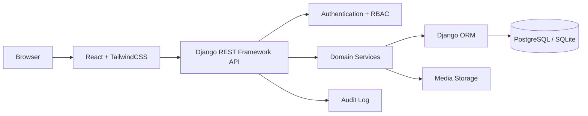
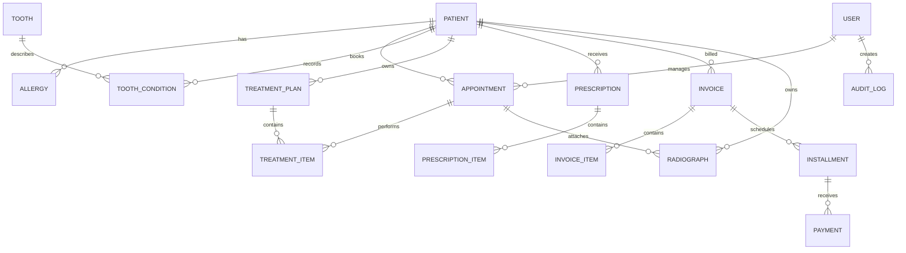

# 02. Design

## 1. Document Information
- Project: Dental Management System (DMS)
- Version: 1.0
- Date: 2026-09-08
- Authors: Nhóm phát triển DMS
- Source requirements: `docs/KN2/01_requirements.md`

## 2. Design Objectives
- Cung cấp kiến trúc web phân lớp, dễ bảo trì và phù hợp với quy mô phòng khám.
- Bảo vệ dữ liệu bệnh nhân bằng xác thực, phân quyền theo vai trò và nhật ký thao tác.
- Đảm bảo lịch hẹn được kiểm tra xung đột trong một giao dịch nhất quán.
- Mô hình hóa đầy đủ hồ sơ bệnh nhân, 32 răng người lớn/20 răng trẻ em, điều trị, thuốc, thanh toán trả góp và ảnh X-quang.
- Cung cấp API REST ổn định để frontend React sử dụng và hỗ trợ PostgreSQL hoặc SQLite thông qua Django ORM.

## 3. Architecture Overview
Hệ thống sử dụng kiến trúc client-server ba lớp. Frontend React chịu trách nhiệm hiển thị giao diện và quản lý trạng thái phiên; backend Django REST Framework cung cấp API, xác thực, phân quyền và nghiệp vụ; database lưu trữ dữ liệu giao dịch. Tệp X-quang được lưu trong media storage và bản ghi metadata được lưu trong database. Trong môi trường phát triển có thể dùng SQLite; môi trường triển khai khuyến nghị PostgreSQL.



### 3.1 Layer Responsibilities
- Presentation layer: React Router, reusable UI components, form validation, calendar, tooth chart và hiển thị lỗi API.
- API layer: Django REST Framework serializers, viewsets/API views, pagination, filtering và chuẩn hóa response.
- Domain/service layer: xử lý đặt lịch chống trùng, cập nhật tooth chart, cảnh báo dị ứng, tính công nợ và trạng thái kế hoạch điều trị.
- Persistence layer: Django models, migrations, transaction management và indexes; không để frontend truy cập database trực tiếp.
- File layer: lưu tệp X-quang ngoài database, chỉ lưu đường dẫn, loại tệp, kích thước và người tải lên trong `Radiograph`.

## 4. Module and Component Design
| ID | Module / Component | Responsibility | Dependencies |
|---|---|---|---|
| MOD-001 | Identity & Access | Đăng nhập, refresh token, quản lý vai trò và quyền | Django auth, JWT, User/Role |
| MOD-002 | Patient Management | CRUD hồ sơ, bệnh sử, dị ứng, tìm kiếm và lịch sử điều trị | Patient, Allergy, Appointment, TreatmentPlan |
| MOD-003 | Appointment Scheduling | Xem lịch, đặt/đổi/hủy/xác nhận lịch và kiểm tra xung đột bác sĩ/phòng | Appointment, User, transaction |
| MOD-004 | Tooth Chart | Hiển thị bộ 32 răng người lớn hoặc 20 răng trẻ em và cập nhật tình trạng | Patient, Tooth, ToothCondition |
| MOD-005 | Treatment Management | Tạo kế hoạch, thêm thủ thuật, cập nhật tiến độ và trạng thái | TreatmentPlan, TreatmentItem, Appointment |
| MOD-006 | Prescription | Tạo đơn thuốc, kiểm tra dị ứng và lưu hướng dẫn dùng thuốc | Prescription, PrescriptionItem, Allergy |
| MOD-007 | Billing & Installment | Lập hóa đơn, dòng dịch vụ, lịch trả góp, ghi nhận thanh toán và công nợ | Invoice, InvoiceItem, Installment, Payment |
| MOD-008 | Radiograph | Upload, kiểm tra metadata, phân quyền xem và liên kết ảnh với bệnh nhân/lần khám | Radiograph, media storage |
| MOD-009 | Reporting & Audit | Tổng hợp lịch, doanh thu, công nợ và nhật ký thay đổi | Invoice, Payment, AuditLog |

### 4.1 Frontend Component Structure
```text
frontend/src/
├── app/
│   ├── App.tsx
│   ├── router.tsx
│   └── auth/
├── components/
│   ├── layout/ (AppShell, Sidebar, Header)
│   ├── common/ (DataTable, Modal, FormField, StatusBadge)
│   ├── patients/ (PatientForm, PatientSummary, AllergyList)
│   ├── appointments/ (Calendar, AppointmentForm, AppointmentDetail)
│   ├── tooth-chart/ (ToothChart, Tooth, ToothConditionPanel)
│   ├── treatment/ (TreatmentPlanForm, TreatmentTimeline)
│   ├── prescriptions/ (PrescriptionForm, AllergyWarning)
│   ├── billing/ (InvoiceForm, InstallmentSchedule, PaymentForm)
│   └── radiographs/ (RadiographUploader, RadiographGallery)
├── pages/ (Dashboard, Patients, Appointments, PatientDetail, Billing, Reports)
├── services/ (apiClient, patientApi, appointmentApi, billingApi)
├── types/ (patient, appointment, treatment, billing)
└── styles/
```

### 4.2 Backend Component Structure
```text
backend/
├── config/ (settings, urls, permissions)
├── apps/
│   ├── accounts/ (models, serializers, views, permissions)
│   ├── patients/ (models, serializers, services, views)
│   ├── appointments/
│   ├── treatments/
│   ├── prescriptions/
│   ├── billing/
│   ├── radiographs/
│   └── audit/
└── manage.py
```

## 5. Data Design
Database dùng khóa chính UUID, trường thời gian UTC và `created_at`/`updated_at` cho các entity nghiệp vụ. Dữ liệu y tế và tài chính thuộc về hồ sơ bệnh nhân; chỉ người dùng được phân quyền mới được đọc hoặc thay đổi. Các trạng thái dùng tập giá trị cố định ở model/serializer để tránh dữ liệu không hợp lệ.



### 5.1 Main Tables
| Table | Key fields | Rules and indexes |
|---|---|---|
| `users` | `id`, `username`, `password_hash`, `role`, `is_active` | Role: RECEPTIONIST, DENTIST, ASSISTANT, MANAGER; unique username. |
| `patients` | `id`, `patient_code`, `full_name`, `date_of_birth`, `phone`, `medical_history`, `dentition_type` | Unique patient code; `dentition_type` is ADULT or CHILD. Index name, phone and code. |
| `allergies` | `id`, `patient_id`, `substance`, `reaction`, `severity`, `is_active` | Substance required; index patient and normalized substance. |
| `appointments` | `id`, `patient_id`, `dentist_id`, `assistant_id`, `room`, `start_at`, `end_at`, `status`, `notes` | `end_at > start_at`; reject overlapping CONFIRMED/IN_PROGRESS appointments for same dentist or room in a transaction. |
| `teeth` | `id`, `code`, `dentition_type`, `display_order` | Seed 32 adult codes and 20 child codes; unique code per dentition. |
| `tooth_conditions` | `id`, `patient_id`, `tooth_id`, `condition`, `note`, `recorded_by`, `recorded_at` | Unique current condition per patient/tooth, with history retained through timestamps. |
| `treatment_plans` | `id`, `patient_id`, `dentist_id`, `title`, `status`, `start_date`, `end_date` | Status: DRAFT, ACTIVE, COMPLETED, CANCELLED. |
| `treatment_items` | `id`, `plan_id`, `appointment_id`, `procedure_name`, `tooth_id`, `cost`, `status` | Cost non-negative; status: PLANNED, IN_PROGRESS, DONE, CANCELLED. |
| `prescriptions` | `id`, `patient_id`, `dentist_id`, `appointment_id`, `issued_at`, `notes` | Immutable after signing except cancellation; linked to allergy check result. |
| `prescription_items` | `id`, `prescription_id`, `medicine_name`, `dosage`, `frequency`, `duration`, `warning_acknowledged` | Medicine name, dose and duration required. |
| `invoices` | `id`, `patient_id`, `invoice_number`, `total_amount`, `paid_amount`, `status`, `issued_at` | Unique invoice number; amount values non-negative; status recalculated transactionally. |
| `invoice_items` | `id`, `invoice_id`, `description`, `quantity`, `unit_price`, `amount` | Amount derived from quantity and unit price, not trusted from client. |
| `installments` | `id`, `invoice_id`, `due_date`, `amount`, `status` | Amount positive; status: PENDING, PARTIAL, PAID, OVERDUE. |
| `payments` | `id`, `invoice_id`, `installment_id`, `amount`, `method`, `paid_at`, `received_by` | Payment amount positive and cannot exceed outstanding balance without manager permission. |
| `radiographs` | `id`, `patient_id`, `appointment_id`, `file_path`, `file_name`, `mime_type`, `file_size`, `uploaded_by` | Allow configured image MIME types and size limit; store file outside database. |
| `audit_logs` | `id`, `actor_id`, `entity_type`, `entity_id`, `action`, `metadata`, `created_at` | Append-only; record changes to patient, appointment, prescription and billing data. |

### 5.2 Validation and Transaction Rules
- Mọi request ghi dữ liệu phải kiểm tra ownership, role và trạng thái entity trước khi lưu.
- Đặt lịch dùng database transaction và row-level locking khi chạy PostgreSQL; SQLite dùng transaction/unique validation phù hợp môi trường phát triển.
- Hóa đơn, installment và payment được cập nhật trong cùng transaction; `paid_amount` không được âm và trạng thái được tính lại sau mỗi payment.
- Khi kê đơn, backend chuẩn hóa tên thuốc và so sánh với allergy active của bệnh nhân; nếu có cảnh báo, bác sĩ phải xác nhận rõ trước khi hoàn tất.
- Không xóa cứng hồ sơ y tế, hóa đơn, đơn thuốc hoặc audit log; dùng trạng thái hủy/ngừng hiệu lực.

## 6. Interface and Interaction Design
| ID | Interface / Screen | Users | Main Actions |
|---|---|---|---|
| UI-001 | Dashboard | Tất cả vai trò | Xem lịch trong ngày, ca đang xử lý, cảnh báo và chỉ số phù hợp quyền. |
| UI-002 | Patient List / Detail | Lễ tân, bác sĩ, phụ tá, quản lý | Tìm kiếm hồ sơ, xem bệnh sử, dị ứng, lịch sử điều trị và ảnh X-quang. |
| UI-003 | Appointment Calendar | Lễ tân, bác sĩ, phụ tá, quản lý | Lọc theo bác sĩ/phòng/ngày; tạo, đổi, xác nhận, hủy lịch; cảnh báo xung đột. |
| UI-004 | Interactive Tooth Chart | Bác sĩ, phụ tá | Chọn bộ răng, chọn răng, cập nhật tình trạng và xem lịch sử ghi nhận. |
| UI-005 | Treatment Plan | Bác sĩ, phụ tá | Tạo kế hoạch, thêm thủ thuật, cập nhật tiến độ và liên kết lịch hẹn. |
| UI-006 | Prescription | Bác sĩ | Chọn thuốc, nhập liều dùng, xem cảnh báo dị ứng và xác nhận đơn. |
| UI-007 | Invoice & Installments | Lễ tân, quản lý | Lập hóa đơn, tạo lịch trả góp, ghi nhận thanh toán và xem số dư. |
| UI-008 | Radiograph Gallery | Bác sĩ, phụ tá, quản lý | Upload, xem, lọc theo lần khám và tải tệp theo quyền. |
| UI-009 | Administration & Reports | Quản lý | Quản lý người dùng, phân quyền, xem doanh thu, công nợ và audit log. |

### 6.1 API Endpoint Design
Base URL: `/api/v1/`. Response JSON dùng cùng cấu trúc lỗi `{ "detail": "...", "code": "...", "fields": {} }`; list endpoint hỗ trợ `page`, `page_size`, `search`, `ordering` khi phù hợp.

| Method | Endpoint | Roles | Purpose |
|---|---|---|---|
| POST | `/auth/token/` | Tất cả | Đăng nhập và cấp access/refresh token. |
| POST | `/auth/token/refresh/` | Tất cả | Làm mới access token. |
| GET/POST | `/patients/` | Lễ tân, bác sĩ, phụ tá, quản lý | Tìm kiếm hoặc tạo hồ sơ bệnh nhân. |
| GET/PATCH | `/patients/{id}/` | Theo quyền hồ sơ | Xem hoặc cập nhật thông tin bệnh nhân. |
| GET/POST | `/patients/{id}/allergies/` | Bác sĩ, phụ tá, quản lý | Xem hoặc ghi nhận dị ứng. |
| GET/POST/PATCH | `/appointments/` | Lễ tân, bác sĩ, phụ tá, quản lý | Tra cứu, tạo hoặc cập nhật lịch; backend kiểm tra trùng. |
| POST | `/appointments/{id}/confirm/` | Lễ tân, quản lý | Xác nhận lịch hẹn. |
| POST | `/appointments/{id}/cancel/` | Lễ tân, quản lý | Hủy lịch với lý do. |
| GET | `/patients/{id}/tooth-chart/` | Bác sĩ, phụ tá, quản lý | Lấy sơ đồ theo loại răng của bệnh nhân. |
| PUT | `/patients/{id}/teeth/{tooth_id}/` | Bác sĩ | Cập nhật tình trạng một răng. |
| GET/POST | `/treatment-plans/` | Bác sĩ, phụ tá, quản lý | Tra cứu hoặc tạo kế hoạch điều trị. |
| PATCH | `/treatment-plans/{id}/items/{item_id}/` | Bác sĩ, phụ tá | Cập nhật thủ thuật và trạng thái. |
| POST | `/prescriptions/` | Bác sĩ | Tạo đơn, chạy allergy check và yêu cầu xác nhận cảnh báo nếu có. |
| GET | `/patients/{id}/prescriptions/` | Bác sĩ, phụ tá, quản lý | Xem lịch sử đơn thuốc. |
| GET/POST | `/invoices/` | Lễ tân, quản lý | Lập hoặc tra cứu hóa đơn. |
| POST | `/invoices/{id}/installments/` | Lễ tân, quản lý | Tạo lịch trả góp. |
| POST | `/invoices/{id}/payments/` | Lễ tân, quản lý | Ghi nhận thanh toán và cập nhật công nợ. |
| GET/POST | `/patients/{id}/radiographs/` | Bác sĩ, phụ tá, quản lý | Upload hoặc xem ảnh X-quang đã liên kết. |
| GET | `/reports/revenue/` | Quản lý | Xem báo cáo doanh thu và công nợ theo khoảng thời gian. |
| GET | `/audit-logs/` | Quản lý | Tra cứu lịch sử thao tác. |

## 7. Security and Access Design
- Authentication: Django REST Framework Simple JWT; access token ngắn hạn, refresh token có thể thu hồi khi logout hoặc đổi mật khẩu; mật khẩu lưu bằng password hasher của Django.
- Authorization: RBAC ở permission class và service layer. Lễ tân quản lý bệnh nhân/lịch/hóa đơn; bác sĩ quản lý khám, tooth chart, điều trị/đơn thuốc; phụ tá hỗ trợ ca và ảnh; quản lý có quyền quản trị và báo cáo.
- Sensitive data handling: HTTPS khi triển khai; không ghi mật khẩu/token vào log; giới hạn quyền xem hồ sơ và tệp X-quang; validate MIME type, kích thước tệp và tên tệp.
- Audit and logging: ghi actor, thời gian, hành động, entity và before/after metadata cho dữ liệu y tế, đơn thuốc, hóa đơn, payment và phân quyền; log ứng dụng không chứa thông tin nhạy cảm không cần thiết.

## 8. Error Handling and Resilience
- Validation errors: trả HTTP 400 với lỗi theo từng field; hiển thị lỗi ngay trên form. Lỗi không đủ quyền trả 403, không tìm thấy tài nguyên trả 404, chưa đăng nhập trả 401.
- External service failures: upload lỗi trả trạng thái rõ ràng và không tạo bản ghi mồ côi; hệ thống không phụ thuộc tích hợp máy X-quang hoặc bảo hiểm ngoài phạm vi.
- Timeout behavior: API timeout theo cấu hình reverse proxy; frontend hiển thị trạng thái tải lại và không tự lặp request ghi dữ liệu.
- Recovery behavior: transaction rollback khi ghi lịch, hóa đơn hoặc thanh toán thất bại; cho phép retry upload và idempotency key cho thao tác payment nếu cần triển khai nhiều instance.

## 8.1 State Transitions
- Appointment: `SCHEDULED -> CONFIRMED -> IN_PROGRESS -> COMPLETED`; có thể chuyển sang `CANCELLED` trước khi hoàn tất.
- Treatment plan: `DRAFT -> ACTIVE -> COMPLETED`; có thể `CANCELLED` khi dừng kế hoạch.
- Invoice: `DRAFT -> ISSUED -> PARTIALLY_PAID -> PAID`; quá hạn có thể đánh dấu `OVERDUE`.

## 9. Design Decisions and Alternatives
| ID | Decision | Alternatives Considered | Reason |
|---|---|---|---|
| ADR-001 | Dùng Django REST Framework và React tách frontend/backend | Django templates; monolith server-rendered | Phù hợp yêu cầu công nghệ, dễ tách trách nhiệm và mở rộng UI tương tác. |
| ADR-002 | Dùng Django ORM, hỗ trợ PostgreSQL và SQLite | Raw SQL; chỉ PostgreSQL | ORM giảm coupling; SQLite thuận tiện phát triển, PostgreSQL phù hợp triển khai. |
| ADR-003 | Dùng JWT + RBAC | Session-only; phân quyền ở frontend | API cần xác thực rõ ràng; quyền phải được kiểm tra ở backend, không tin frontend. |
| ADR-004 | Lưu file X-quang ở media storage, metadata ở DB | Lưu binary trực tiếp trong database | Giảm kích thước transaction và thuận lợi thay storage; vẫn truy xuất được theo bệnh nhân/lần khám. |
| ADR-005 | Kiểm tra trùng lịch trong transaction ở backend | Chỉ cảnh báo ở giao diện | Backend là nguồn sự thật, tránh race condition khi nhiều lễ tân cùng đặt lịch. |

## 10. Design Traceability
| Requirement ID | Design Element | Notes |
|---|---|---|
| REQ-F-001 | MOD-002, UI-002, `/patients/` | Hồ sơ, bệnh sử, dị ứng và tra cứu lịch sử. |
| REQ-F-002 | MOD-003, UI-003, `/appointments/` | Transaction kiểm tra xung đột bác sĩ/phòng. |
| REQ-F-003 | MOD-004, UI-004, `tooth_conditions` | Seed 32 răng người lớn và 20 răng trẻ em. |
| REQ-F-004 | MOD-005, UI-005, `treatment_plans` | Theo dõi kế hoạch và thủ thuật theo trạng thái. |
| REQ-F-005 | MOD-006, UI-006, `/prescriptions/` | Allergy check trước khi hoàn tất đơn. |
| REQ-F-006 | MOD-007, UI-007, `invoices`/`payments` | Tính số dư và lịch trả góp trong transaction. |
| REQ-F-007 | MOD-008, UI-008, `radiographs` | Metadata DB, tệp ảnh ở media storage. |
| REQ-F-008 | MOD-001, UI-009, permission classes | RBAC cho bốn vai trò. |
| REQ-NF-001 | Section 7, `audit_logs` | Xác thực, phân quyền và audit. |
| REQ-NF-002 | Section 3, indexes | Index cho patient code, phone, lịch và thời gian. |
| REQ-NF-003 | Section 5.2, Section 8 | Transaction và rollback cho nghiệp vụ ghi. |
| REQ-NF-005 | Section 3, Section 4 | Tách frontend, API, service và persistence layer. |

## 11. Design Review Checklist
- [x] Requirements are covered.
- [x] Responsibilities are clearly separated.
- [x] Security considerations are documented.
- [x] Data flows are documented.
- [x] Open design questions are recorded: định dạng/giới hạn ảnh X-quang, chính sách trả góp và quy trình cảnh báo dị ứng cần được xác nhận ở bước triển khai.

STATUS: PASS
