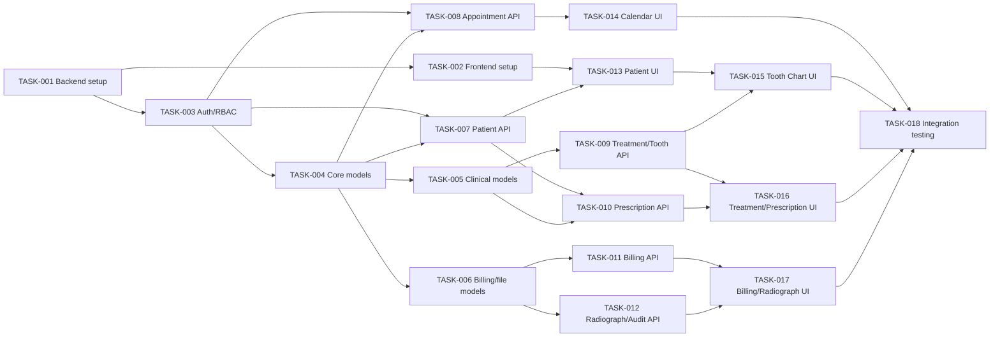

# 03. Implementation Plan

## 1. Document Information
- Project: Dental Management System (DMS)
- Version: 1.0
- Date: 2026-09-08
- Source design: `docs/KN2/02_design.md`
- Project lead: Trưởng nhóm phát triển
- Team members: Backend developer, frontend developer, QA engineer, đại diện phòng khám

## 2. Implementation Objectives
- Thiết lập môi trường chạy được cho Django REST Framework, React, TailwindCSS và PostgreSQL/SQLite.
- Xây dựng schema và migration cho toàn bộ dữ liệu bệnh nhân, lịch hẹn, răng, điều trị, đơn thuốc, hóa đơn, trả góp và X-quang.
- Hoàn thành API REST có xác thực JWT, RBAC, kiểm tra nghiệp vụ và response lỗi thống nhất.
- Hoàn thành giao diện cho bốn vai trò, trong đó Tooth Chart hỗ trợ 32 răng người lớn và 20 răng trẻ em.
- Xác nhận luồng nghiệp vụ chính bằng unit test, API test, component test và integration test.

## 2.1 Priority Definition
- P0 - Bắt buộc để hệ thống có thể chạy và nghiệm thu: setup, auth, models, patient, appointment, treatment, billing cơ bản.
- P1 - Bắt buộc cho đầy đủ phạm vi: Tooth Chart, prescription/allergy, radiograph, installment, RBAC đầy đủ.
- P2 - Cải thiện sau MVP: báo cáo nâng cao, tối ưu UX và hardening hiệu năng.

## 3. Work Breakdown Structure
| ID | Work Item | Priority | Owner | Dependencies | Deliverable | Test Plan |
|---|---|---|---|---|---|---|
| TASK-001 | Backend setup và cấu hình Django/DRF | P0 | Backend | Không | Project Django, app modules, settings theo môi trường, API health check, CORS và cấu hình media. | Chạy migrate từ môi trường sạch; kiểm tra health endpoint; kiểm tra settings không lộ secret. |
| TASK-002 | Frontend setup và design system cơ bản | P0 | Frontend | TASK-001 | React Router, TailwindCSS, AppShell, layout, FormField, Modal, DataTable, StatusBadge và API client. | Build production; render smoke test; kiểm tra route bảo vệ và trạng thái loading/error. |
| TASK-003 | Identity, JWT và RBAC | P0 | Backend | TASK-001 | User/role, token login/refresh, permission classes cho lễ tân, bác sĩ, phụ tá, quản lý. | Unit test token; API test 401/403; matrix test quyền cho từng endpoint. |
| TASK-004 | Database models và migrations nền tảng | P0 | Backend | TASK-001, TASK-003 | Models `users`, `patients`, `allergies`, `appointments`, `teeth`, `tooth_conditions` cùng indexes, constraints và migration. | Migration up/down; tạo dữ liệu hợp lệ; test unique patient code, ngày giờ và foreign key. |
| TASK-005 | Database models và migrations điều trị/y tế | P0 | Backend | TASK-004 | Models `treatment_plans`, `treatment_items`, `prescriptions`, `prescription_items`, trạng thái và audit fields. | Model/serializer validation; test state transition; test liên kết bệnh nhân/bác sĩ. |
| TASK-006 | Database models và migrations tài chính/tệp | P1 | Backend | TASK-004 | Models `invoices`, `invoice_items`, `installments`, `payments`, `radiographs`, `audit_logs`; media storage config. | Test amount non-negative, invoice totals, payment balance, file MIME/size và migration. |
| TASK-007 | API Patient Management | P0 | Backend | TASK-003, TASK-004 | CRUD/search `/patients/`, patient detail, allergies và lịch sử liên quan. | API happy path; validation field; search/pagination; ownership và RBAC test. |
| TASK-008 | API Appointment Scheduling | P0 | Backend | TASK-003, TASK-004 | `/appointments/`, confirm/cancel, filter lịch và chống trùng bác sĩ/phòng bằng transaction. | API create/update/cancel; overlap same dentist/room; concurrent transaction test; timezone test. |
| TASK-009 | API Treatment và Tooth Chart | P0/P1 | Backend | TASK-003, TASK-004, TASK-005 | Treatment plan/items và `/patients/{id}/tooth-chart/`, cập nhật tooth condition. | Test CRUD/state; seed đúng 32/20 răng; test răng không thuộc dentition; permission test. |
| TASK-010 | API Prescription và cảnh báo dị ứng | P1 | Backend | TASK-003, TASK-005, TASK-007 | Tạo đơn, allergy check, prescription items và lịch sử đơn thuốc. | Test không dị ứng; test có dị ứng bắt buộc acknowledgement; test đơn đã ký không sửa trái phép. |
| TASK-011 | API Billing, installment và payment | P0/P1 | Backend | TASK-003, TASK-006, TASK-007 | Invoices, invoice items, installment schedule, payments, outstanding balance và trạng thái hóa đơn. | Test tính tổng; thanh toán một phần/toàn bộ; vượt số dư; rollback khi lỗi; RBAC manager. |
| TASK-012 | API Radiograph và Audit/Reports | P1/P2 | Backend | TASK-003, TASK-006, TASK-007 | Upload/list X-quang, metadata, audit logs và báo cáo doanh thu/công nợ. | File validation; quyền xem; audit event test; filter report theo ngày và bệnh nhân. |
| TASK-013 | Frontend auth, shell và patient screens | P0 | Frontend | TASK-002, TASK-003, TASK-007 | Login, route guards, Dashboard, Patient List/Detail, PatientForm và AllergyList. | Component test form; route guard test; mock API success/error; accessibility smoke test. |
| TASK-014 | Frontend appointment calendar | P0 | Frontend | TASK-013, TASK-008 | Calendar, AppointmentForm, AppointmentDetail, filter bác sĩ/phòng/ngày và conflict feedback. | Component interaction test; create/reschedule/cancel; hiển thị lỗi trùng từ API; timezone display. |
| TASK-015 | Frontend Tooth Chart | P1 | Frontend | TASK-013, TASK-009 | `ToothChart`, `Tooth`, `ToothConditionPanel`, chuyển ADULT/CHILD và lưu tình trạng. | Snapshot/DOM test đủ 32/20 răng; click chọn răng; save/error/reload state; permission UI test. |
| TASK-016 | Frontend treatment và prescription | P1 | Frontend | TASK-013, TASK-009, TASK-010 | TreatmentPlanForm, TreatmentTimeline, PrescriptionForm và AllergyWarning. | Test state transition; cảnh báo dị ứng phải được xác nhận; validation liều/duration. |
| TASK-017 | Frontend billing và radiograph | P1 | Frontend | TASK-013, TASK-011, TASK-012 | InvoiceForm, InstallmentSchedule, PaymentForm, RadiographUploader/Gallery. | Test tính số dư hiển thị; payment error; upload progress/retry; chặn file không hợp lệ. |
| TASK-018 | Integration testing và release hardening | P0 | QA + toàn nhóm | TASK-008, TASK-010, TASK-011, TASK-014, TASK-015, TASK-016, TASK-017 | Bộ integration/E2E test, seed dữ liệu demo, test report và checklist release. | Chạy full backend/frontend test; E2E luồng tiếp nhận đến thanh toán; security/performance smoke test. |

## 4. Milestones and Schedule
| Milestone | Planned Start | Planned Finish | Exit Criteria |
|---|---|---|---|
| M-001 - Foundation & Backend Setup | Sprint 1 | Sprint 1 | TASK-001 đến TASK-003 hoàn tất; backend health check, frontend shell build được và RBAC cơ bản chạy. |
| M-002 - Database Models & Migrations | Sprint 2 | Sprint 2 | TASK-004 đến TASK-006 hoàn tất; migration sạch, constraints/indexes được kiểm thử và seed teeth sẵn sàng. |
| M-003 - Core Backend APIs | Sprint 3 | Sprint 4 | TASK-007 đến TASK-009 hoàn tất; patient, appointment, treatment và tooth chart API đạt test acceptance. |
| M-004 - Clinical & Financial APIs | Sprint 5 | Sprint 5 | TASK-010 đến TASK-012 hoàn tất; prescription allergy warning, billing/installment/payment và radiograph API hoạt động. |
| M-005 - Frontend Components & Screens | Sprint 6 | Sprint 7 | TASK-013 đến TASK-017 hoàn tất; bốn vai trò dùng được các màn hình thuộc phạm vi. |
| M-006 - Integration Testing & Release | Sprint 8 | Sprint 8 | TASK-018 đạt toàn bộ quality gates; không còn lỗi P0/P1 mở và có biên bản nghiệm thu luồng chính. |

### 4.1 Dependency Order

## 5. Development Approach
- Branching strategy: `main` luôn ổn định; mỗi task dùng branch `feature/TASK-xxx-short-name`; merge qua pull request sau review và CI.
- Coding standards: Python theo PEP 8 và Django conventions; TypeScript strict; component/function có tên mô tả; API dùng serializer validation; không commit secret.
- Review process: mỗi pull request phải liên kết task, có test tương ứng, review ít nhất một thành viên và kiểm tra migration/API contract nếu có thay đổi.
- Documentation process: cập nhật README/API notes khi endpoint thay đổi; ghi migration decision và open issue; cập nhật traceability từ requirement đến task/test.

## 6. Environment and Tooling
| Environment | Purpose | Configuration Owner | Readiness |
|---|---|---|---|
| Development | Phát triển local backend/frontend và SQLite nhanh | Backend + Frontend | Ready after M-001 |
| Test | Chạy unit, API, component và integration test độc lập | QA | Ready after M-002 |
| Staging | Kiểm thử E2E với PostgreSQL và media storage gần production | DevOps/Backend | Planned at M-006 |
| Production | Vận hành chính thức, backup database và media | DevOps/Quản lý phòng khám | Planned after approval |

### 6.1 Required Tooling
- Backend: Python, Django, Django REST Framework, Simple JWT, pytest/pytest-django, formatter/linter theo cấu hình repository.
- Frontend: Node.js, React, TypeScript, TailwindCSS, test runner/component testing library theo cấu hình repository.
- Data: SQLite cho local mặc định; PostgreSQL cho staging/production; migration và seed command dùng chung.
- Quality: Git, pull request CI, API client/OpenAPI notes, test fixtures và test data không chứa dữ liệu bệnh nhân thật.

## 7. Dependencies and Resources
| Dependency | Purpose | Version / Source | Owner | Status |
|---|---|---|---|---|
| Django REST Framework | Xây dựng REST API | Theo `requirements.txt`/lockfile | Backend | Required |
| Django ORM | Models, migration, transaction | Theo backend lockfile | Backend | Required |
| Simple JWT | Access/refresh token | Theo backend lockfile | Backend | Required |
| React + TypeScript | Frontend component và routing | Theo `package.json` | Frontend | Required |
| TailwindCSS | Styling và design system | Theo `package.json` | Frontend | Required |
| PostgreSQL | Database staging/production | Phiên bản theo deployment config | DevOps | Planned |
| SQLite | Database local/development | Built-in Python support | Backend | Ready |
| Media storage | Lưu tệp X-quang | Local media hoặc object storage | DevOps | Planned |

## 8. Risk and Mitigation Plan
| Risk ID | Risk | Impact | Probability | Mitigation | Owner |
|---|---|---|---|---|---|
| R-001 | Quy tắc trùng lịch khác nhau giữa SQLite và PostgreSQL khi có concurrent request. | High | Medium | Bao transaction/service test; dùng PostgreSQL ở staging; không chỉ dựa vào frontend validation. | Backend |
| R-002 | Dữ liệu dị ứng thiếu hoặc tên thuốc không chuẩn hóa. | High | Medium | Chuẩn hóa input, cảnh báo rõ, bắt buộc bác sĩ xác nhận và audit acknowledgement. | Bác sĩ + Backend |
| R-003 | Tệp X-quang quá lớn hoặc sai định dạng. | Medium | Medium | Giới hạn MIME/size, upload retry, media storage và test tệp độc hại/không hợp lệ. | Backend + DevOps |
| R-004 | Sai số công nợ hoặc payment do ghi nhiều bước. | High | Low | Decimal field, tính amount ở backend, transaction/rollback và integration test payment. | Backend + QA |
| R-005 | Lộ dữ liệu bệnh nhân qua log hoặc quyền sai. | High | Low | RBAC backend, audit review, không log secret/PII không cần thiết và security test trước release. | Backend + QA |
| R-006 | Phạm vi Tooth Chart 32/20 răng gây lỗi hiển thị hoặc mapping. | Medium | Medium | Seed data cố định, test số lượng/code, component test cho cả ADULT và CHILD. | Frontend + QA |
| R-007 | Thay đổi API làm frontend không tương thích. | Medium | Medium | Version `/api/v1/`, API contract review, mock fixtures và CI chạy frontend integration test. | Backend + Frontend |

## 9. Quality Gates
- [x] Requirements approved: `docs/KN2/01_requirements.md` đã đạt `STATUS: PASS`.
- [x] Design reviewed: `docs/KN2/02_design.md` đã đạt `STATUS: PASS`.
- [ ] Implementation reviewed: hoàn tất sau khi các task P0/P1 được merge.
- [ ] Automated checks pass: tất cả unit/API/component/integration test phải pass trong CI.
- [ ] Manual validation completed: đại diện bốn vai trò nghiệm thu các luồng chính trên staging.
- [ ] No open P0/P1 defects: kiểm tra tại M-006 trước phát hành.

## 10. Communication and Reporting
- Status meeting: họp ngắn đầu mỗi sprint; rà soát blocker hằng ngày trong giai đoạn M-006.
- Progress report: cập nhật task board và báo cáo cuối sprint theo milestone, gồm hoàn thành, rủi ro và test status.
- Issue tracking: mỗi issue có severity, reproduction steps, owner, target milestone và liên kết task/test.
- Escalation path: developer -> tech lead -> project lead -> quản lý phòng khám đối với blocker nghiệp vụ hoặc rủi ro dữ liệu.

## 11. Plan Approval
- Prepared by: Nhóm phát triển DMS
- Reviewed by: Tech lead, QA engineer và đại diện phòng khám
- Approved by: TBD

STATUS: PASS
